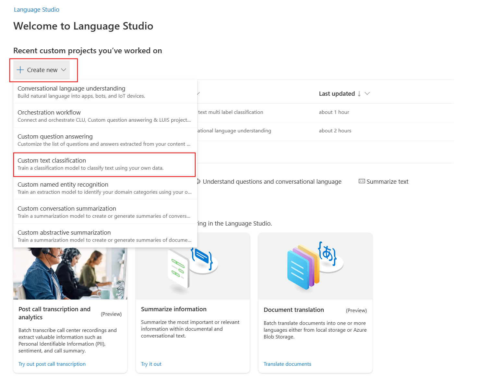
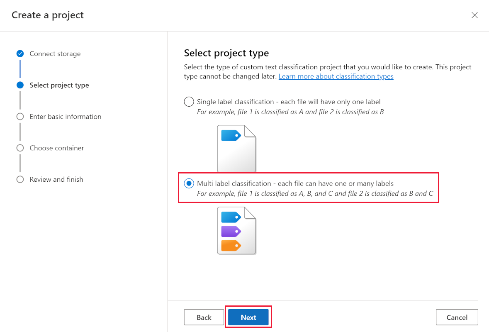

---
lab:
  title: カスタム クラスで AI 検索インデックスをエンリッチする
---

# カスタム クラスで AI 検索インデックスをエンリッチする

検索ソリューションを構築したので、次は言語エンリッチメント用の Azure AI サービスをインデックスに追加します。

この演習では、Azure AI 検索ソリューションを作成し、Language Studio のカスタム テキスト分類プロジェクトの結果を使用してインデックスをエンリッチします。 検索と分類モデルを結び付ける関数アプリを作成します。

> **注** この演習を完了するには、Microsoft Azure サブスクリプションが必要です。 まだお持ちでない場合は、[https://azure.com/free](https://azure.com/free?azure-portal=true) から無料試用版にサインアップできます。

## Python、VS Code、VS Code 拡張機能を使用して開発環境を設定する

これらのツールをインストールして、この演習を完了します。 これらのツールを使用しなくても、手順を進めることはできます。

1. [VS Code](https://code.visualstudio.com/) をインストールします
1. [Azure Core Functions Tool](https://github.com/Azure/azure-functions-core-tools) をインストールします
1. [VS Code 用の Azure Tools 拡張機能](https://code.visualstudio.com/docs/azure/extensions)をインストールする
1. ご自分のオペレーティング システム用の [Python 3.8](https://www.python.org/downloads/release/python-380/) をインストールします。
1. [VS Code 用の Python 拡張機能](https://marketplace.visualstudio.com/items?itemName=ms-python.python)をインストールする

## Azure リソースを設定する

時間を節約するために、この Azure ARM テンプレートを選択して、演習の後半で必要になるリソースを作成します。

### 事前構築済みの ARM テンプレートをデプロイする

1. [](https://portal.azure.com/#create/Microsoft.Template/uri/https%3A%2F%2Fraw.githubusercontent.com%2FMicrosoftLearning%2Fmslearn-doc-intelligence%2Fmain%2Fcognitive-search%2Fazuredeploy.json) このリンクを選択して、開始リソースを作成します。 [直接リンク](https://portal.azure.com/#create/Microsoft.Template/uri/https%3A%2F%2Fraw.githubusercontent.com%2FMicrosoftLearning%2Fmslearn-doc-intelligence%2Fmain%2Fcognitive-search%2Fazuredeploy.json)をコピーし、検索バーに貼り付けることが必要になる場合があります。

    
1. **[リソース グループ]** で、**[新規作成]** を選択して **cog-search-language-exe** という名前を付けます。
1. **[リージョン]** で、お近くの[サポート対象リージョン](/azure/ai-services/language-service/custom-text-classification/service-limits#regional-availability)を選択します。
1. **[リソース プレフィックス]** はグローバルに一意である必要があります。ランダムな数値と小文字の文字プレフィックス (例: **acs18245**) を入力します。
1. **[場所]** で、上記で選択したものと同じリージョンを選択します。
1. **[確認と作成]** を選択します。
1. **［作成］** を選択します

    > **注** **このリソースを正常に作成するには、以下のサービス使用条件に同意する必要があります**、というエラーが表示されます。**[作成]** を選択すると、同意することになります。

1. **[リソース グループに移動]** を選択して、作成したすべてのリソースを表示します。

    
Azure Cognitive Search インデックスを設定し、Azure 関数を作成し、Language Studio プロジェクトを作成して、概要から映画ジャンルを特定します。

### 言語サービスをトレーニングするためのサンプル データをアップロードする

この演習では、映画のプロットの概要が含まれる 210 個のテキスト ファイルを使用します。 テキスト ファイル名は映画のタイトルです。 このフォルダーには、映画のジャンルをファイルにマップする **movieLabels.json** ファイルも含まれています。ファイルごとに、次のような JSON エントリがあります。

```json
{
    "location": "And_Justice_for_All.txt",
    "language": "en-us",
    "classifiers": [
        {
            "classifierName": "Mystery"
        },
        {
            "classifierName": "Drama"
        },
        {
            "classifierName": "Thriller"
        },
        {
            "classifierName": "Comedy"
        }
    ]
},
```

1. GitHub から[サンプル データ](https://github.com/Azure-Samples/cognitive-services-sample-data-files/blob/master/language-service/Custom%20text%20classification/Custom%20multi%20classification%20-%20movies%20summary.zip)をダウンロードして、コンピューターにローカルに保存します。

    
1. **Custom multi classification - movies summary.zip** ファイルを開き、すべてのファイルが含まれるフォルダーを展開します。

    > **注** これらのファイルを使用して Language Studio でモデルをトレーニングし、Azure Cognitive Search 内のすべてのファイルにインデックスを付けます。

1. [Azure portal](https://portal.azure.com/) で **[リソース グループ]** を選択し、該当するリソース グループを選択します。
1. 作成したストレージ アカウント (例: **acs18245str**) を選択します。

    
1. 左側から **[コンテナー]** を選択し、**[+ コンテナー]** を選択します。
1. **[新しいコンテナー]** ペインの **[名前]** に「**language-studio-training-data**」と入力します。
1. **[匿名アクセス レベル]** で **[コンテナー (コンテナーと BLOB の匿名読み取りアクセス)]** を選択します。
1. **［作成］** を選択します
1. 先ほど作成した新しいコンテナー **language-studio-training-data** を選択します。
    
1. ペインの上部にある **[アップロード]** を選択します。
1. **[BLOB のアップロード]** ペインで、**[ファイルの参照]** を選択します。
1. サンプル ファイルをダウンロードした場所に移動し、すべてのテキスト (`.txt`) ファイルと json (`.json`) ファイルを選択します。
1. ペインで **[アップロード]** を選択します。
1. **[BLOB のアップロード]** ペインを閉じます。

### 言語リソースを作成する

1. ページの上部にある階層リンクで、**[ホーム]** を選択します。
1. **[言語サービス]** で **[作成]** を選択します。
1. **［作成］** を選択します
1. **カスタム テキスト分類とカスタム固有表現認識**を含むオプションを選択します。

    
1. **[リソースの作成を続行する]** を選択します。

    
1. **[リソース グループ]** で、**cog-search-language-exe** を選択します。
1. **[リージョン]** で、上記で使用したリージョンを選択します。
1. **[名前]** に、「**learn-language-service-for-custom-text**」と入力します。 これはグローバルに一意である必要があるため、ランダムな数値または文字を末尾に追加しなければならないことがあります。
1. **[価格レベル]** で、**[S]** を選択します。
1. **[新規/既存のストレージ アカウント]** で、**[既存のストレージ アカウント]** を選択します。
1. **[現在選択されているサブスクリプションとリソース リージョンのストレージ アカウント]** で、作成したストレージ アカウント (例: **acs18245str**) を選択します。
1. **責任ある AI の通知**の条件に同意し、**[確認と作成]** を選択します。
1. **［作成］** を選択します
1. リソースがデプロイされるまで待ってから、**[リソース グループに移動]** を選択します。
1. **learn-language-service-for-custom-text** を選択します。

    
1. **[概要]** ペインを下にスクロールし、**[Language Studio を開始する]** を選択します。
1. 言語リソースの選択を求められた場合は、先ほど作成したリソースを選択します。

### Language Studio でカスタム テキスト分類プロジェクトを作成する

1. Language Studio のホーム ページで、**[新規作成]** を選択し、**[カスタム テキスト分類]** を選択します。

    

1. **[次へ]** を選択します。

    
1. **[複数ラベル分類]** を選択し、**[次へ]** を選択します。

    

1. **[名前]** に「**movie-genre-classifier**」と入力します。
1. **[テキストの第 1 言語]** で、**英語 (米国)** を選択します。
1. **[説明]** に「**概要から映画ジャンルを特定できるモデル**」と入力します。
1. **[Yes, enable multi-lingual dataset]\(はい、多言語データセットを有効にする\)** を選択します。
1. **[次へ]** を選択します。

    

1. **[Blob ストレージ コンテナー]** で、**language-studio-training-data** を選択します。
1. **[はい、ドキュメントには既にラベルが付けられていて、正しい形式の JSON ラベル ファイルがあります]** を選択します。
1. **[ラベル ドキュメント]** で、**movieLabels** を選択します。
1. **[次へ]** を選択します。
1. **[プロジェクトの作成]** を選択します。

### カスタム テキスト分類 AI モデルをトレーニングする

1. 左側の **[トレーニング ジョブ]** を選択します。

    

1. **[+ トレーニング ジョブの開始]** を選択します。

    
1. **[新しいモデルのトレーニング]** に「**movie-genre-classifier**」と入力します。
1. **[Train](トレーニング)** を選択します。
1. 分類モデルのトレーニングは 10 分かかりません。 状態が **[トレーニング成功]** に変わるのを待ちます。

### カスタム テキスト分類 AI モデルをデプロイする

1. 左側の **[モデルのデプロイ]** を選択します。

    
1. **[デプロイの追加]** を選択します。

    
1. **[新しいデプロイ名の作成]** に「**test-release**」と入力します。
1. **[モデル]** で、**movie-genre-classifier** を選択します。
1. **[デプロイ]** を選択します。

この演習の後半で使用するので、この Web ページは開いたままにしておきます。

### Azure AI 検索インデックスを作成する

このモデルでエンリッチできる検索インデックスを作成します。ダウンロード済みの映画の概要が含まれるテキスト ファイルすべてにインデックスを付けます。

1. [Azure portal](https://portal.azure.com/) で、**[リソース グループ]** を選択し、該当するリソース グループを選択して、作成したストレージ アカウント (例: **acs18245str**) を選択します。
1. 左側から **[コンテナー]** を選択し、**[+ コンテナー]** を選択します。
1. **[新しいコンテナー]** ペインの **[名前]** に「**search-data**」と入力します。
1. **[匿名アクセス レベル]** で、**[コンテナー]** を選択します。
1. **［作成］** を選択します
1. 先ほど作成した新しいコンテナー **search-data** を選択します。
1. ペインの上部にある **[アップロード]** を選択します。
1. **[BLOB のアップロード]** ペインで、**[ファイルの参照]** を選択します。
1. サンプル ファイルをダウンロードした場所に移動し、テキスト (`.txt`) ファイル**のみ**を選択します。
1. ペインで **[アップロード]** を選択します。
1. **[BLOB のアップロード]** ペインを閉じます。

### Azure AI 検索 にドキュメントをインポートする

1. 左側で **[リソース グループ]** を選択し、該当するリソース グループを選択して、検索サービスを選択します。

1. **[データのインポート]** を選択します。

    
1. **[データ ソース]** で、**Azure Blob Storage** を選択します。
1. **[データ ソース名]** に「**movie-summaries**」と入力します。
1. **[既存の接続の選択]** を選択し、該当するストレージ アカウントを選択して、先ほど作成したコンテナー **search-data** を選択します。
1. **[コグニティブ スキルの追加 (省略可能)]** を選択します。
1. **[AI サービスのアタッチ]** セクションを展開し、無料の Azure AI サービスを選択します。

    
1. **[エンリッチメントの追加]** セクションを展開します。

    
1. すべてのフィールドを既定値のままにして、**[ユーザー名を抽出]** を選択します。
1. **[キー フレーズを抽出]** を選択します。
1. **[言語の検出]** を選択します。
1. **[次へ: 対象インデックスをカスタマイズします]** を選択します。

    
1. すべてのフィールドを既定値のままにします。**metadata_storage_name** は、**[取得可能]** と **[検索可能]** を選択します。
1. **[次へ: インデクサーの作成]** を選択します。
1. **[Submit](送信)** をクリックします。

インデクサーが実行され、210 個のテキスト ファイルのインデックスが作成されます。 これを待たなくても、次の手順に進むことができます。

## 検索インデックスをエンリッチする関数アプリを作成する

Cognitive Search カスタム スキルセットから呼び出す Python 関数アプリを作成します。 この関数アプリでは、カスタム テキスト分類モデルを使用して、検索インデックスをエンリッチします。

1. ターミナルで、この GitHub リポジトリをマシンにクローンします。

    ```bash
    git clone https://github.com/MicrosoftLearning/mslearn-doc-intelligence movie-genre-function
    ```

1. Visual Studio Code で、先ほどクローンした **movie-genre-function** フォルダーを開きます。

    
1. 必要な拡張機能をすべてインストールしている場合、プロジェクトを最適化するように求められます。 **[はい]** を選択します。
    
1. Python インタープリターを選択します。バージョン 3.8 である必要があります。
1. ワークスペースが更新されます。ワークスペース フォルダーに接続するように求められた場合は、**[はい]** を選択します。
1. **F5** キーを押して、アプリをデバッグします。

    
    アプリが実行されている場合は、ローカル テストに使用できる localhost URL が表示されます。

1. アプリのデバッグを停止し、**Shift** + **F5** キーを押します。

### ローカル関数アプリを Azure にデプロイする

1. Visual Studio Code で、**F1** キーを押してコマンド パレットを開きます。
1. コマンド パレットで、`Azure Functions: Create Function App in Azure...` を検索して選択します。
1. 関数アプリにグローバルに一意の名前 (例: **acs13245str-function-app**) を入力します。
1. **[ランタイム スタックを選択してください]** で、**Python 3.8** を選択します。
1. 上記で使用したのと同じ場所を選択します。

1. 左側のナビゲーションで、**Azure** 拡張機能を選択します。
    
1. **[リソース]** を展開し、サブスクリプションの **[関数アプリ]** を展開して、関数 (例: **acs13245-function-app**) を右クリックします。
1. **[関数アプリにデプロイ]** を選択します。 アプリがデプロイされるまで待ちます。
1. アプリを展開し、**[アプリケーションの設定]** を右クリックし、**[リモート設定のダウンロード]** を選択します。
1. 左側の **[エクスプローラー]** を選択し、**local.settings.json** を選択します。

    
関数アプリをカスタム テキスト分類モデルに接続する必要があります。 構成設定を取得するには、次の手順に従います。

1. ブラウザーで **Language Studio** に移動すると、**[モデルのデプロイ]** ページが表示されます。

    
1. モデルを選択します。 [**予測 URL の取得**] を選択します。
1. **[予測 URL]** の横にあるコピー アイコンを選択します。
1. Visual Studio Code で、**local.settings.json** の最後に予測 URL を貼り付けます。
1. **Language Studio** の左側にある **[プロジェクトの設定]** を選択します。

    
1. **主キー**の横にあるコピー アイコンを選択します。
1. Visual Studio Code で、**local.settings.json** の最後に主キーを貼り付けます。
1. 設定を編集して、次の 4 行を最後に追加し、エンドポイントを `TA_ENDPOINT` 値にコピーします。

    ```json
    ,
    "TA_ENDPOINT": " [your endpoint] ",
    "TA_KEY": " [your key] ",
    "DEPLOYMENT": "test-release",
    "PROJECT_NAME": "movie-genre-classifier"
    ```

1. 主キーを `TA_KEY` 値にコピーします。

    ```json
    {
      "IsEncrypted": false,
      "Values": {
        "AzureWebJobsStorage": "DefaultEndpointsProtocol=https;AccountName=...",
        "FUNCTIONS_EXTENSION_VERSION": "~4",
        "FUNCTIONS_WORKER_RUNTIME": "python",
        "WEBSITE_CONTENTAZUREFILECONNECTIONSTRING": "DefaultEndpointsProtocol=https;AccountName=...",
        "WEBSITE_CONTENTSHARE": "acs...",
        "APPINSIGHTS_INSTRUMENTATIONKEY": "6846...",
        "TA_ENDPOINT": "https://learn-languages-service-for-custom-text.cognitiveservices.azure.com/language/analyze-text/jobs?api-version=2022-05-01",
        "TA_KEY": "7105e938ce1...",
        "DEPLOYMENT": "test-release",
        "PROJECT_NAME": "movie-genre-classifier"
      }
    }

    ```

    上記のように、設定にプロジェクトの値が表示されます。
 
1. **Ctrl **+** S** キーを押して、**local.settings.json** の変更を保存します。
1. 左側のナビゲーションで、**Azure** 拡張機能を選択します。
1. **[リソース]** を展開し、サブスクリプションの **[関数アプリ]** を展開して **[アプリケーションの設定]** を右クリックし、**[ローカル設定のアップロード]** を選択します。

### リモート関数アプリをテストする

関数アプリと分類モデルが正しく動作していることをテストするために使用できるサンプル クエリがあります。

1. 左側の **[エクスプローラー]** を選択し、**customtectcla** フォルダーを展開して、**sample.dat** を選択します。

    
1. ファイルの内容をコピーします。
1. 左側で、**Azure** 拡張機能を選択します。

    
1. **[関数アプリ]** で、**[関数]** を展開し、**customtextcla** を右クリックして、**[今すぐ関数を実行]** を選択します。
1. **[要求本文の入力]** で、コピーしたサンプル データを貼り付けて、**Enter** キーを押します。

    この関数アプリは JSON 結果で応答します。

1. 通知を展開して結果全体を表示します。

    
    JSON 応答は次のようになります。

    ```json
    {"values": 
        [
            {"recordId": "0", 
            "data": {"text": 
            [
                {"category": "Action", "confidenceScore": 0.99}, 
                {"category": "Comedy", "confidenceScore": 0.96}
            ]}}
        ]
    }
    ```

### 検索インデックスにフィールドを追加する

新しい関数アプリから返されるエンリッチメントを格納する場所が必要です。 次の手順に従って、テキスト分類と信頼度スコアを格納する新しい複合フィールドを追加します。

1. [Azure portal](https://portal.azure.com/) で、該当する検索サービスを含むリソース グループに移動し、作成したコグニティブ検索サービス (**例: acs18245-search-service**) を選択します。
1. **[概要]** ペインで、**[インデックス]** を選択します。
1. **azurebob-index** を選択します。
1. **[JSON の編集]** を選択します。
1. 新しいフィールドをインデックスに追加し、コンテンツ フィールドの下に JSON を貼り付けます。

    ```json
    {
      "name": "textclass",
      "type": "Collection(Edm.ComplexType)",
      "analyzer": null,
      "synonymMaps": [],
      "fields": [
        {
          "name": "category",
          "type": "Edm.String",
          "facetable": true,
          "filterable": true,
          "key": false,
          "retrievable": true,
          "searchable": true,
          "sortable": false,
          "analyzer": "standard.lucene",
          "indexAnalyzer": null,
          "searchAnalyzer": null,
          "synonymMaps": [],
          "fields": []
        },
        {
          "name": "confidenceScore",
          "type": "Edm.Double",
          "facetable": true,
          "filterable": true,
          "retrievable": true,
          "sortable": false,
          "analyzer": null,
          "indexAnalyzer": null,
          "searchAnalyzer": null,
          "synonymMaps": [],
          "fields": []
        }
      ]
    },
    ```

    これで、インデックスは次のようになります。

    
1. **[保存]** を選択します。

### カスタム スキルセットを編集して関数アプリを呼び出す

Cognitive Search インデックスには、これらの新しいフィールドを設定する方法が必要です。 前に作成したスキルセットを編集して、関数アプリを呼び出します。

1. ページの上部で、検索サービス リンク (例: **acs18245-search-service | Indexes**) を選択します。

1. **[概要]** ペインで、**[スキルセット]** を選択します。

    
1. **azureblob-skillset** を選択します。
1. 最初のスキルセットとして貼り付けることで、以下のカスタム スキルセット定義を追加します。

    ```json
    {
      "@odata.type": "#Microsoft.Skills.Custom.WebApiSkill",
      "name": "Genre Classification",
      "description": "Identify the genre of your movie from its summary",
      "context": "/document",
      "uri": "URI",
      "httpMethod": "POST",
      "timeout": "PT30S",
      "batchSize": 1,
      "degreeOfParallelism": 1,
      "inputs": [
        {
          "name": "lang",
          "source": "/document/language"
        },
        {
          "name": "text",
          "source": "/document/content"
        }
      ],
      "outputs": [
        {
          "name": "text",
          "targetName": "class"
        }
      ],
      "httpHeaders": {}
    },
    ```

`"uri": "URI"` を関数アプリをポイントするように変更する必要があります。

1. Visual Studio Code で、**Azure** 拡張機能を選択します。

    
1. **[関数]** で、**customtextcla** を右クリックし、**[関数 URL のコピー]** を選択します。
1. Azure portal で、URI を、コピーした関数 URL に置き換えます。 
1. **[保存]** を選択します。

### インデクサーでフィールド マッピングを編集する

これで、エンリッチメントを格納するフィールド、関数アプリを呼び出すスキルセットが追加されました。最後の手順で、エンリッチメントを配置する場所を Cognitive Search に指示します。

1. ページの上部で、検索サービス (例: **acs18245-search-service | Skillsets**) リンクを選択します。

    
1. **[概要]** ペインで、**[インデクサー]** を選択します。
1. **azureblob-indexer** を選択します。
1. **[インデクサー定義 (JSON)]** を選択します。
1. このフィールド定義を出力フィールド セクションの先頭に貼り付けて、新しい出力フィールド マッピングを追加します。

    ```json
    {
      "sourceFieldName": "/document/class",
      "targetFieldName": "textclass"
    },
    ```

    インデクサー JSON 定義は次のようになります。

    
1. **[保存]** を選択します。
1. **[リセット]** を選択してから、**[はい]** を選択します。
1. **[実行]** を選択してから、**[はい]** を選択します。

    Azure Cognitive Search サービスによって、更新されたインデクサーが実行されます。 インデクサーによって、編集したカスタム スキルセットが使用されます。 スキルセットから、インデックスが付けられているドキュメントを使用して関数アプリが呼び出されます。 カスタム テキスト分類モデルで、ドキュメント内のテキストを使用して、映画のジャンルを特定しようとします。 モデルから、ジャンルと信頼度レベルを含む JSON ドキュメントが返されます。 インデクサーによって、新しい出力フィールド マッピングを使用して、JSON 結果がインデックス内のフィールドにマップされます。

1. **[実行履歴]** を選択します。
1. インデクサーが 210 個のドキュメントに対して正常に実行されたことを確認します。

    
    場合により、**[更新]** を選択してインデクサーの状態を更新する必要があります。

## エンリッチされた検索インデックスをテストする

1. ページの上部で、検索サービス (例: **acs18245-search-service | Indexers**) を選択します。

1. **[概要]** ペインで、**[インデックス]** を選択します。
1. **azurebob-index** を選択します。

    
1. **[Search]** を選択します。
1. 検索結果を調べます。

インデックス内のドキュメントごとに、検索できる新しい `textclass` フィールドが必要です。 これには、映画ジャンルが設定されるカテゴリ フィールドが含まれます。 複数指定することもできます。 また、特定されたジャンルに関するカスタム テキスト分類モデルの信頼度も示されます。

これで演習が完了したので、不要になったすべてのリソースを削除します。

### 演習用リソースを削除する

1. Azure portal のホーム ページで、**[リソース グループ]** を選択します。
1. 不要なリソース グループを選び、**[リソース グループの削除]** を選択します。
