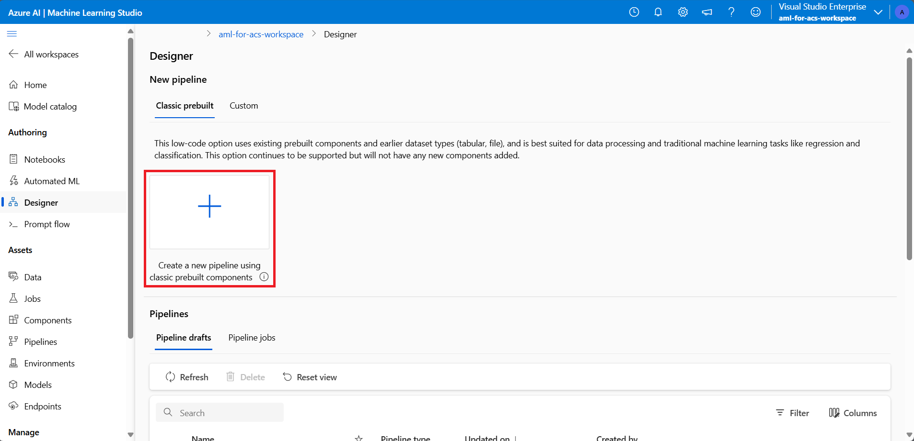
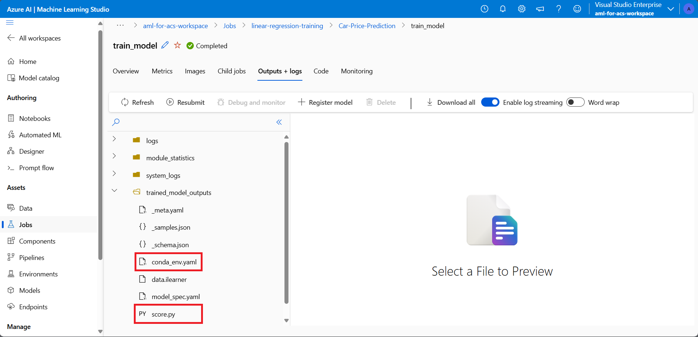

---
lab:
  title: Azure Machine Learning モデルを使用して検索インデックスのエンリッチメントを行います
---

# Azure Machine Learning モデルを使用して検索インデックスのエンリッチメントを行います

機械学習の力を使って、検索インデックスをエンリッチできます。 これを行うには、Azure AI Machine Learning スタジオでトレーニングしたモデルを使用して、機械学習のカスタム スキルセットから呼び出します。

この演習では、Azure AI Machine Learning スタジオ モデルを作成し、そのモデルを使用してエンドポイントをトレーニング、デプロイ、テストします。 次に、その Azure AI Machine Learning スタジオ エンドポイントを使用して、Azure Cognitive Search サービスを作成し、サンプル データを作成して、インデックスをエンリッチします。

> **注** この演習を完了するには、Microsoft Azure サブスクリプションが必要です。 アカウントを取得済みでない場合は、[https://azure.com/free](https://azure.com/free?azure-portal=true) から無料評価版にサインアップできます。
>

## Azure Machine Learning ワークスペースを作成する

検索インデックスをエンリッチする前に、Azure Machine Learning ワークスペースを作成します。 ワークスペースから Azure AI Machine Learning スタジオにアクセスできるようになります。このグラフィカル ツールを用いて、使用する AI モデルの構築とデプロイを行えます。

1. [Azure portal](https://portal.azure.com) にサインインします。
1. **[+ リソースの作成]** を選択します。
1. 機械学習を検索し、**Azure Machine Learning** を選択します。
1. **［作成］** を選択します
1. **[リソース グループ]** で **[新規作成]** を選択し、"**aml-for-acs-enrichment**" という名前を付けます。
1. [ワークスペースの詳細] セクションで、 **[名前]** に、「**aml-for-acs-workspace**」と入力します。
1. お近くのサポート対象**リージョン**を選択します。
1. **[ストレージ アカウント]**、**[キー コンテナー]**、**[アプリケーション分析情報]**、**[コンテナー レジストリ]** には既定値を使用します。
1. **[Review + create](レビュー + 作成)** を選択します。
1. **［作成］** を選択します
1. Azure Machine Learning ワークスペースがデプロイされるまで待ってから、**[リソースに移動]** を選択します。
1. [概要] ペインで、**[スタジオの起動]** を選択します。

## 回帰トレーニング パイプラインを作成する

次に、回帰モデルを作成し、Azure AI Machine Learning スタジオ パイプラインを使用してトレーニングを行います。 自動車価格データで、作成したモデルをトレーニングします。 トレーニングが完了したモデルは、自動車の価格をその属性に基づいて予測します。

1. ホーム ページで、**[デザイナー]** を選択します。

1. 事前構築済みコンポーネントのリストから、**回帰 - 自動車価格予測 (基本)** を選択します。

    

1. **[検証]** を選択します。

1. **[グラフの検証]** ペインで、"**送信ウィザードでコンピューティング先を選択してください**" エラーを選択します。

    
1. **[コンピューティングの種類の選択]** のドロップダウンから、**[コンピューティング インスタンス]** を選択します。 次に下にある **[Azure ML コンピューティング インスタンスを作成する]** を選択します。
1. **[コンピューティング名]** フィールドに、一意の名前 (例: "**compute-for-training**") を入力します。
1. **[確認および作成]** を選択し、次に **[作成]** を選択します。

1. **[Azure ML コンピューティング インスタンスの選択]** フィールドで、ドロップダウンからインスタンスを選択します。 プロビジョニングの完了には時間がかかる場合があります。

1. もう一度、**[検証]** を選択すると、パイプラインが正しく表示されるはずです。

    ![パイプラインが正しく表示され、[送信] ボタンが強調表示されているスクリーンショット。](../media/06-media/submit-pipeline.png)
1. **[パイプライン ジョブの設定]** ペインで **[基本]** を選択します。
1. 実験名で **[新規作成]** を選択します。
1. **[新しい実験名]** に、「**線形回帰トレーニング**」と入力します。
1. **[レビューと送信]** を選択し、そこで **[送信]** を選択します。

### エンドポイントの推論クラスターを作成する

パイプラインで線形回帰モデルをトレーニングしている間に、エンドポイントに必要なリソースを作成できます。 このエンドポイントには、モデルへの Web 要求を処理するために Kubernetes クラスターが必要です。

1. 左側にある **[コンピューティング]** を選択します。

    
1. **[Kubernetes クラスター]** を選択し、そこで **[+ 新規]** を選択します。
1. ドロップダウンから、**[AksCompute]** を選択します。
1. **[AksCompute の作成]** ペインで、**[新規作成]** を選択します。
1. **[場所]** は、他のリソースの作成に使用したのと同じリージョンを選択します。
1. VM サイズ リストで、**Standard_A2_v2** を選択します。
1. **[次へ]** を選択します。
1. **[コンピューティング名]** に「**、aml-acs-endpoint**」と入力します。
1. **[SSL 構成を有効にする]** を選択します。
1. **[リーフ ドメイン]** に「**aml-for-acs**」と入力します。
1. **［作成］** を選択します

### トレーニング済みのモデルを登録する

パイプライン ジョブが終了している必要があります。 `score.py` と`conda_env.yaml` のファイルをダウンロードします。 次に、トレーニング済みのモデルを登録します。

1. 左側で、**[ジョブ]** を選択します。

    
1. 実験を選択し、そこで、テーブルの完了したジョブ (たとえば **回帰 - 自動車価格予測 (Basic)**) を選択します。 変更の保存を求めるメッセージが表示されたら、変更を **[破棄する]** を選択します。
1. デザイナーで、右上の **[ジョブの概要]** を選択し、そこで、**[モデルのトレーニング]** ノードを選択します。

    
1. **[出力とログ]** タブで、**trained_model_outputs** フォルダーを展開します。
1. `score.py` の横で、その他のメニュー (**...**) を選択し、**[ダウンロード]** を選択します。
1. `conda_env.yaml` の横で、その他のメニュー (**...**) を選択し、**[ダウンロード]** を選択します。
1. タブの上部にある **[+ モデルを登録する]** を選択します。
1. **[ジョブ出力]** フィールドで、**trained_model_outputs** フォルダーを選択します。 それから、ウィンドウの下部にある **[次へ]** を選択します。
1. モデルの **[名前]** には、「**carevalmodel**」 と入力します。
1. **[説明]** に、「**自動車の価格を予測する線形回帰モデル**」と入力します。
1. [**次へ**] を選択します。
1. **登録** を選択します。

### Azure AI 検索に正しく応答するようにスコアリング スクリプトを編集する

Azure Machine Learning スタジオで、2 つのファイルがお使いの Web ブラウザーの既定のダウンロード場所にダウンロードされました。 score.py ファイルを編集して、JSON 要求と応答の処理方法を変更する必要があります。 テキスト エディターや、Visual Studio Code のようなコード エディターを使用できます。

1. お使いのエディターで、score.py ファイルを開きます。
1. run 関数のすべての内容を置き換えます。

    ```python
    def run(data):
    data = json.loads(data)
    input_entry = defaultdict(list)
    for row in data:
        for key, val in row.items():
            input_entry[key].append(decode_nan(val))

    data_frame_directory = create_dfd_from_dict(input_entry, schema_data)
    score_module = ScoreModelModule()
    result, = score_module.run(
        learner=model,
        test_data=DataTable.from_dfd(data_frame_directory),
        append_or_result_only=True)
    return json.dumps({"result": result.data_frame.values.tolist()})
    ```

    次の Python コードを使用します。

    ```python
    def run(data):
        data = json.loads(data)
        input_entry = defaultdict(list)
        
        for key, val in data.items():
                input_entry[key].append(decode_nan(val))
    
        data_frame_directory = create_dfd_from_dict(input_entry, schema_data)
        score_module = ScoreModelModule()
        result, = score_module.run(
            learner=model,
            test_data=DataTable.from_dfd(data_frame_directory),
            append_or_result_only=True)
        output = result.data_frame.values.tolist()
        
        return {
                "predicted_price": output[0][-1]
        }    
    ```

    上記の変更により、このモードでは、車の配列ではなく、車属性を持つ単一の JSON オブジェクトを受け取ることができるようになります。

    もう 1 つの変更は、JSON 応答全体ではなく、車の予測価格のみを返すことです。
1. テキスト エディターで変更を保存します。

## カスタム環境を作成する

次に、カスタム環境を作成して、リアルタイム エンドポイントへのデプロイを行えるようにします。

1. ナビゲーション ペインで、**環境** を選択します。
1. **[カスタム環境]** タブを選択します。
1. **[+ 作成]** を選択します。
1. **[名前]** には、「**my-custom-environment**」と入力します。
1. **[環境の種類の選択]** のキュレーションされた環境のリストで、**[automl-gpu:2]** を選択します。
1. [**次へ**] を選択します。
1. ローカル コンピューターで、先ほどダウンロードした `conda_env.yaml` ファイルを開き、その中身をコピーします。
1. ブラウザーに戻り、[カスタマイズ] ペインで **[conda_dependencies.yaml]** を選択します。
1. 右側のウィンドウで、その内容を先ほどコピーしたコードに置き換えます。
1. **[次へ]** を選択し、さらにもう一度 **[次へ]** を選択します。
1. **[作成]** を選択して、カスタム環境を作成します。

## 更新されたスコアリング コードを使用してモデルをデプロイする <!--Option for web service deployment is greyed out. Can't go further after trying several different things.-->

これで、推論クラスターを使用する準備が整いました。 また、Azure Cognitive Search カスタム スキルセットからの要求を処理するように、スコアリング コードを編集しました。 モデルのエンドポイントを作成してテストしてみましょう。

1. 左側で、**[モデル]** を選択します。
1. 登録したモデル (**carevalmodel**) を選択します。

1. **[デプロイ]** を選択し、そこで **[リアルタイム エンドポイント]** を選択します。

    ![[エンドポイントの選択] ウィンドウのスクリーンショット。](../media/06-media/04-select-endpoint.png)
1. **[名前]** には、「**car-evaluation-endpoint**」 と入力します。
1. **[コンピューティングの種類]** は、**[マネージド]** を選択します。
1. **[認証の種類]** は **[キーベースの認証]** を選択します。
1. **[次へ]** を選択し、さらに **[次へ]** を選択します。
1. **次へ**を再度選択します。
1. **[推論用スコアリング スクリプトの選択]** フィールドで、更新した `score.py` ファイルを参照して選択します。
1. **[環境の種類の選択]** ドロップダウンから、**[カスタム環境]** を選択します。
1. リストの作成したカスタム環境のチェック ボックスをオンにして選択します。
1. [**次へ**] を選択します。
1. [仮想マシン] は、**[Standard_D2as_v4]** を選択します。
1. **[インスタンス数]** を **1** に設定します。
1. **[次へ]** を選択し、さらにもう一度 **[次へ]** を選択します。
1. **［作成］** を選択します

モデルがデプロイされるまで待ちます。最大 10 分かかる場合があります。 状態は、Azure Machine Learning スタジオの **[通知]** または [エンドポイント] セクションで確認できます。

### トレーニング済みのモデルのエンドポイントをテストする

1. 左側で、 **[エンドポイント]** を選択します。
1. **car-evaluation-endpoint** を選択します。
1. **[テスト]** を選択し、**[テスト エンドポイントにデータを入力する]** に、次の例の JSON を貼り付けます。

    ```json
    {
        "symboling": 2,
        "make": "mitsubishi",
        "fuel-type": "gas",
        "aspiration": "std",
        "num-of-doors": "two",
        "body-style": "hatchback",
        "drive-wheels": "fwd",
        "engine-location": "front",
        "wheel-base": 93.7,
        "length": 157.3,
        "width": 64.4,
        "height": 50.8,
        "curb-weight": 1944,
        "engine-type": "ohc",
        "num-of-cylinders": "four",
        "engine-size": 92,
        "fuel-system": "2bbl",
        "bore": 2.97,
        "stroke": 3.23,
        "compression-ratio": 9.4,
        "horsepower": 68.0,
        "peak-rpm": 5500.0,
        "city-mpg": 31,
        "highway-mpg": 38,
        "price": 0.0
    }
    ```

1. **[テスト]** を選択すると、次の応答が表示されます。

    ```json
    {
        "predicted_price": 5790.948226933133
    }
    ```

1. **[使用]** を選択します。

    
1. **REST エンドポイント**をコピーします。
1. **主キー**をコピーします。

### Azure Machine Learning モデルを Azure AI 検索と統合する

次に、新しい Cognitive Search サービスを作成し、カスタム スキルセットを使用してインデックスをエンリッチします。

### テスト ファイルを作成する

1. [Azure portal](https://portal.azure.com/learn.docs.microsoft.com?azure-portal=true) で、[リソース グループ] を選択します。
1. **aml-for-acs-enrichment** を選択します。

    
1. ストレージ アカウント (例: **amlforacsworks1440637584**) を選択します。
1. **[設定]** で **[構成]** を選択します。 次に **[BLOB 匿名アクセスを許可する]** を **[有効]** に設定します。
1. **[保存]** を選択します。
1. **[データ ストレージ]** で、**[コンテナー]** を選択します。 
1. インデックス データを格納する新しいコンテナーを作成し、**[+ コンテナー]** を選択します。
1. **[新しいコンテナー]** ペインの **[名前]** に「**docs-to-search**」と入力します。
1. **[匿名アクセス レベル]** で **[コンテナー (コンテナーと BLOB の匿名読み取りアクセス)]** を選択します。
1. **［作成］** を選択します
1. 作成した **docs-to-search** コンテナーを選択します。
1. テキスト エディターで、JSON ドキュメントを作成します。

    ```json
    {
      "symboling": 0,
      "make": "toyota",
      "fueltype": "gas",
      "aspiration": "std",
      "numdoors": "four",
      "bodystyle": "wagon",
      "drivewheels": "fwd",
      "enginelocation": "front",
      "wheelbase": 95.7,
      "length": 169.7,
      "width": 63.6,
      "height": 59.1,
      "curbweight": 2280,
      "enginetype": "ohc",
      "numcylinders": "four",
      "enginesize": 92,
      "fuelsystem": "2bbl",
      "bore": 3.05,
      "stroke": 3.03,
      "compressionratio": 9.0,
      "horsepower": 62.0,
      "peakrpm": 4800.0,
      "citympg": 31,
      "highwaympg": 37,
      "price": 0
    }
    ```

    ドキュメントに拡張子を付けて `test-car.json` という名前でコンピューターに保存します。
1. ポータルで、**[アップロード]** を選択します。
1. **[BLOB のアップロード]** ペインで、**[ファイルの参照]** を選択し、この JSON ドキュメントを保存した場所に移動して選択します。
1. **[アップロード]** を選択します。

### Azure AI Search リソースを作成する

1. Azure portal のホーム ページで、**[+ リソースの作成]** を選択します。
1. 「**search**」を検索し、**[Azure AI 検索]** を選択します。
1. **［作成］** を選択します
1. **[リソース グループ]** で、**aml-for-acs-enrichment** を選択します。
1. [サービス名] に、「**acs-enriched**」と入力します。
1. **[場所]** は、先ほど使用したものと同じリージョンを選択します。
1. **[Review + create](確認と作成)** を選択し、次に **[作成]** を選択します。
1. リソースがデプロイされるまで待ってから、**[リソースに移動]** を選択します。
1. **[データのインポート]** を選択します。
1. **[データへの接続]** ペインの **[データ ソース名]** フィールドで、**[Azure Blob　Storage]** を選択します。
1. **[データ ソース名]** に、「**import-docs**」と入力します。
1. **[解析モード]** で、**[JSON]** を選択します。
1. **[接続文字列]** で、**[既存の接続を選択します]** を選択します。
1. アップロード先のストレージ アカウント (例: **amlforacsworks1440637584**) を選択します。
1. **[コンテナー]** ペインで、**docs-to-search** を選択します。 
1. **[選択]** を選択します。
1. **[次へ: コグニティブ スキルの追加 (省略可能)]** を選択します。

### コグニティブ スキルを追加する

1. **[エンリッチメントの追加]** を展開し、**[ユーザー名を抽出]** を選択します。
1. **[次へ: 対象インデックスをカスタマイズします]** を選択します。
1. **[+ フィールドの追加]** を選択し、リストの下部の **[フィールド名]** に "**predicted_price**" と入力します。
1. **[型]** では、新しいエントリに対して **[Edm.Double]** を選択します。
1. すべてのフィールドについて **[取得可能]** を選択します。
1. **[make (メーカー)]** に対して **[検索可能]** を選択します。
1. **[次へ: インデクサーの作成]** を選択します。
1. **[Submit](送信)** をクリックします。

## AML スキルをスキルセットに追加する

次に、ユーザー名エンリッチメントを Azure Machine Learning カスタム スキルセットに置き換えます。

1. [概要] ペインで、**[検索管理]** の **[スキルセット]** を選択します。
1. **[名前]** で、**azureblob-skillset** を選択します。
1. `EntityRecognitionSkill` のスキル定義を次の JSON に置き換え、必ず、コピーしたエンドポイントと主キーの値に置き換えてください。

    ```json
    "@odata.type": "#Microsoft.Skills.Custom.AmlSkill",
    "name": "AMLenricher",
    "description": "AML studio enrichment example",
    "context": "/document",
    "uri": "PASTE YOUR AML ENDPOINT HERE",
    "key": "PASTE YOUR PRIMARY KEY HERE",
    "resourceId": null,
    "region": null,
    "timeout": "PT30S",
    "degreeOfParallelism": 1,
    "inputs": [
      {
        "name": "symboling",
        "source": "/document/symboling"
      },
      {
        "name": "make",
        "source": "/document/make"
      },
      {
        "name": "fuel-type",
        "source": "/document/fueltype"
      },
      {
        "name": "aspiration",
        "source": "/document/aspiration"
      },
      {
        "name": "num-of-doors",
        "source": "/document/numdoors"
      },
      {
        "name": "body-style",
        "source": "/document/bodystyle"
      },
      {
        "name": "drive-wheels",
        "source": "/document/drivewheels"
      },
      {
        "name": "engine-location",
        "source": "/document/enginelocation"
      },
      {
        "name": "wheel-base",
        "source": "/document/wheelbase"
      },
      {
        "name": "length",
        "source": "/document/length"
      },
      {
        "name": "width",
        "source": "/document/width"
      },
      {
        "name": "height",
        "source": "/document/height"
      },
      {
        "name": "curb-weight",
        "source": "/document/curbweight"
      },
      {
        "name": "engine-type",
        "source": "/document/enginetype"
      },
      {
        "name": "num-of-cylinders",
        "source": "/document/numcylinders"
      },
      {
        "name": "engine-size",
        "source": "/document/enginesize"
      },
      {
        "name": "fuel-system",
        "source": "/document/fuelsystem"
      },
      {
        "name": "bore",
        "source": "/document/bore"
      },
      {
        "name": "stroke",
        "source": "/document/stroke"
      },
      {
        "name": "compression-ratio",
        "source": "/document/compressionratio"
      },
      {
        "name": "horsepower",
        "source": "/document/horsepower"
      },
      {
        "name": "peak-rpm",
        "source": "/document/peakrpm"
      },
      {
        "name": "city-mpg",
        "source": "/document/citympg"
      },
      {
        "name": "highway-mpg",
        "source": "/document/highwaympg"
      },
      {
        "name": "price",
        "source": "/document/price"
      }
    ],
    "outputs": [
      {
        "name": "predicted_price",
        "targetName": "predicted_price"
      }
    ]  
    ```

1. **[保存]** を選択します。

### 出力フィールド マッピングを更新する

1. **[概要]** ペインに戻り、**[インデクサー]** を選択し、そこで **[azureblob-indexer]** を選択します。
1. **インデクサー定義 (JSON)** タブを選択し、**outputFieldMappings** の値を次のように変更します。

    ```json
    "outputFieldMappings": [
        {
          "sourceFieldName": "/document/predicted_price",
          "targetFieldName": "predicted_price"
        }
      ]
    ```

1. **[保存]** を選択します。
1. **[リセット]** を選択してから、**[はい]** を選択します。
1. **[実行]** を選択してから、**[はい]** を選択します。

## インデックス エンリッチメントをテストする

更新されたスキルセットによって、予測値がインデックス内のテスト カー ドキュメントに追加されるようになります。 これをテストするには、次の手順に従います。

1. お使いの検索サービスの **[概要]** ペインで、ペインの上部にある **[検索エクスプローラー]** を選択します。
1. **[Search]** を選択します。
1. 結果の一番下までスクロールします。
    
設定フィールド `predicted_price` が表示されます。

## 演習用リソースを削除する

これで演習が完了したので、不要になったすべてのリソースを削除します。 Azure リソースを削除します。

1. **Azure portal** で、[リソース グループ] を選択します。
1. 不要なリソース グループを選び、**[リソース グループの削除]** を選択します。
