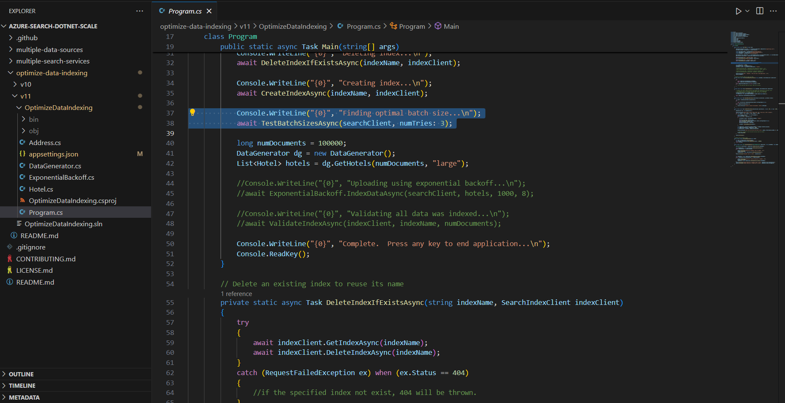
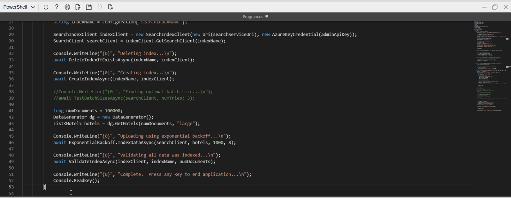

---
lab:
  title: プッシュ API を使ってインデックスに追加する
---

# プッシュ API を使ってインデックスに追加する

あなたは、Azure AI Search インデックスを作成し、C# コードを使ってそのインデックスにドキュメントをアップロードする方法を調べたいと考えています。

この演習では、既存の C# ソリューションをクローンし、それを実行して、ドキュメントをアップロードするための最適なバッチ サイズを計算します。 その後、このバッチ サイズを使用し、スレッド化されたアプローチを使ってドキュメントを効果的にアップロードします。

> **注** この演習を完了するには、Microsoft Azure サブスクリプションが必要です。 まだお持ちでない場合は、[https://azure.com/free](https://azure.com/free?azure-portal=true) から無料試用版にサインアップできます。

## Azure リソースを設定する

時間を節約するために、この Azure Resource Manager テンプレートを選び、演習の後半で必要になるリソースを作成します。

1. [Azure にリソースをデプロイする](https://portal.azure.com/#create/Microsoft.Template/uri/https%3A%2F%2Fraw.githubusercontent.com%2FMicrosoftLearning%2Fmslearn-knowledge-mining%2Fmain%2FLabfiles%2F07-exercise-add-to-index-use-push-api%20lab-files%2Fazuredeploy.json) - Azure AI リソースを作成するには、このリンクを選択します。
    
1. **[リソース グループ]** で、**[新規作成]** を選択して **cog-search-language-exe** という名前を付けます。
1. **[リージョン]** で、お近くの[サポート対象リージョン](/azure/ai-services/language-service/custom-text-classification/service-limits#regional-availability)を選択します。
1. **[リソース プレフィックス]** はグローバルに一意である必要があります。たとえば **acs118245** など、ランダムな数値と小文字の文字プレフィックスを入力します。
1. **[場所]** で、上記で選んだものと同じリージョンを選択します。
1. **[確認と作成]** を選択します。
1. **［作成］** を選択します
1. デプロイが完了したら、**[リソース グループに移動]** を選んで作成したすべてのリソースを表示します。

    

### Azure AI Search サービスの REST API 情報をコピーする

1. リソースの一覧で、作成した検索サービスを選択します。 上の例では、**acs118245-search-service** です。
1. 検索サービス名をテキスト ファイルにコピーします。

    ![検索サービスの [キー] セクションのスクリーンショット。](../media/07-media/search-api-keys-exercise-version.png)
1. 左側の **[キー]** を選択し、**[プライマリ管理者キー]** を同じテキスト ファイルにコピーします。

### サンプル コードをダウンロードする

Azure portal の上部にある [Cloud Shell] ボタンを選んで Azure Cloud Shell を開きます。
> **注** Azure Storage アカウントの作成を求められた場合は、**[ストレージの作成]** を選びます。

1. 起動が完了したら、Cloud Shell で以下のコマンドを実行して、次のサンプル コード リポジトリをクローンします。

    ```powershell
    git clone https://github.com/Azure-Samples/azure-search-dotnet-scale.git samples
    ```

1. 以下を実行して、新しく作成したディレクトリに移動します。

    ```powershell
    cd samples
    ```

1. 次に、次のコマンドを実行します。

    ```powershell
    code ./optimize-data-indexing/v11
    ```

1. その結果、`/optimize-data-indexing/v11` フォルダーで、Cloud Shell 内にコード エディターが開きます。

    
1. 左側のナビゲーションで **OptimizeDataIndexing** フォルダーを展開し、**appsettings.json** ファイルを選択します。

    
1. 検索サービス名とプライマリ管理者キーを貼り付けます。

    ```json
    {
      "SearchServiceUri": "https://acs118245-search-service.search.windows.net",
      "SearchServiceAdminApiKey": "YOUR_SEARCH_SERVICE_KEY",
      "SearchIndexName": "optimize-indexing"
    }
    ```

    設定ファイルは上記のようになるはずです。
1. **Ctrl + S** キーを押して変更を保存します。
1. **OptimizeDataIndexing.csproj** ファイルを選びます。 <!-- Added this and the next two steps in case we can't update the file in the repo that holds these (seems to be separate from the other labs)-->
1. 5 行目の `<TargetFramework>netcoreapp3.1</TargetFramework>` を `<TargetFramework>net7.0</TargetFramework>` に変更します。 <!--- can be removed if no longer needed based on the above-->
1. **Ctrl + S** キーを押して変更を保存します。<!--- can be removed if no longer needed based on the above-->
1. ターミナルで「`cd ./optimize-data-indexing/v11/OptimizeDataIndexing`」と入力し、**Enter** キーを押して正しいディレクトリに変更します。
1. **Program.cs** ファイルを選択します。 次に、ターミナルで「`dotnet run`」と入力し、**Enter** キーを押します。

    
出力は、この場合、最もパフォーマンスの高いバッチ サイズが 900 ドキュメントであることを示しています。 1 秒あたり 3.688 MB に達しているためです。

### コードを編集してスレッド処理およびバックオフと再試行の戦略を実装する

スレッドを使用してドキュメントを検索インデックスにアップロードするようにアプリを変更する準備ができているコードがコメントアウトされています。

1. **Program.cs** を選んでいることを確認します。

    
1. 次のように 38 行目と 39 行目をコメント アウトします。

    ```csharp
    //Console.WriteLine("{0}", "Finding optimal batch size...\n");
    //await TestBatchSizesAsync(searchClient, numTries: 3);
    ```

1. 41 行目から 49 行目のコメントを解除します。

    ```csharp
    long numDocuments = 100000;
    DataGenerator dg = new DataGenerator();
    List<Hotel> hotels = dg.GetHotels(numDocuments, "large");

    Console.WriteLine("{0}", "Uploading using exponential backoff...\n");
    await ExponentialBackoff.IndexDataAsync(searchClient, hotels, 1000, 8);

    Console.WriteLine("{0}", "Validating all data was indexed...\n");
    await ValidateIndexAsync(indexClient, indexName, numDocuments);
    ```

    スレッドのバッチ サイズと数を制御するコードは `await ExponentialBackoff.IndexDataAsync(searchClient, hotels, 1000, 8)` です。 バッチ サイズは 1000 で、スレッドは 8 です。

    
    コードは上記のようになるはずです。

1. 変更を保存し、**Ctrl**+**S** キーを押します。
1. ターミナルを選び、実行中のプロセスをまだ終了していない場合は、任意のキーを押して終了します。
1. ターミナルで `dotnet run` を実行します。

    
    アプリによって 8 つのスレッドが開始され、各スレッドではコンソールへの新しいメッセージの書き込みが完了します。

    ```powershell
    Finished a thread, kicking off another...
    Sending a batch of 1000 docs starting with doc 57000...
    ```

    100,000 件のドキュメントがアップロードされると、アプリによって概要が作成されます (完了までに時間がかかる場合があります)。

    ```powershell
    Ended at: 9/1/2023 3:25:36 PM
    
    Upload time total: 00:01:18:0220862
    Upload time per batch: 780.2209 ms
    Upload time per document: 0.7802 ms
    
    Validating all data was indexed...
    
    Waiting for service statistics to update...
    
    Document Count is 100000
    
    Waiting for service statistics to update...
    
    Index Statistics: Document Count is 100000
    Index Statistics: Storage Size is 71453102
    
    ``````

`TestBatchSizesAsync` プロシージャのコードを調べて、コードでバッチ サイズのパフォーマンスがどのようにテストされるかを確認します。

`IndexDataAsync` プロシージャのコードを調べて、コードでスレッド処理がどのように管理されるかを確認します。

`ExponentialBackoffAsync` 内のコードを調べて、コードで指数バックオフ再試行戦略がどのように実装されるか確認します。

Azure portal で、インデックスにドキュメントが追加されていることを見つけて確認します。


### 演習用リソースを削除する

これで演習が完了したので、不要になったすべてのリソースを削除します。 まずはコンピューターにクローンされたコードから始めます。 その後、Azure リソースを削除します。

1. **Azure portal** で、[リソース グループ] を選択します。
1. この演習で作成したリソース グループを選びます。
1. **[リソース グループの削除]** を選択します。 
1. 削除を確認してから **[削除]** を選びます。
1. 不要なリソースを選んでから、**[削除]** を選択します。
