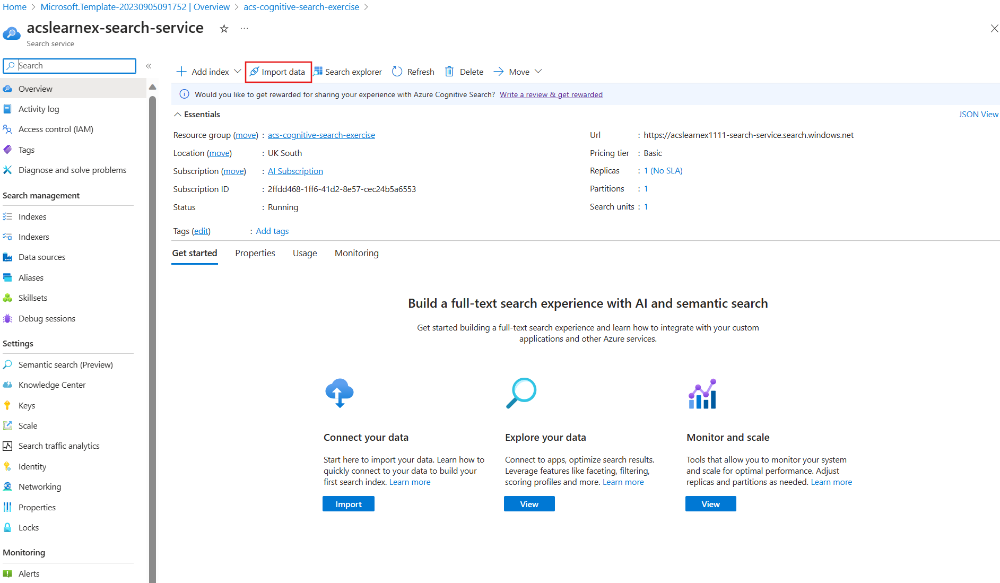

---
lab:
  title: 検索の問題をデバッグする
---

# 検索の問題をデバッグする

あなたは検索ソリューションを構築しましたが、インデクサーに対する警告がいくつか発生していることに気付きました。

この演習では、Azure AI 検索ソリューションを作成し、サンプル データをインポートしてから、インデクサーに対する警告を解決します。

> **注** この演習を完了するには、Microsoft Azure サブスクリプションが必要です。 アカウントを取得済みでない場合は、[https://azure.com/free](https://azure.com/free?azure-portal=true) から無料評価版にサインアップできます。

## 検索ソリューションを作成する

デバッグ セッションの使用を開始する前に、Azure Cognitive Search サービスを作成する必要があります。

1. [リソースを Azure にデプロイする](https://portal.azure.com/#create/Microsoft.Template/uri/https%3A%2F%2Fraw.githubusercontent.com%2FAzure-Samples%2Fazure-search-knowledge-mining%2Fmain%2Fazuredeploy.json) - このリンクを選択して、Azure portal で必要なすべてのリソースをデプロイします。

    

1. **[リソース グループ]** で **[新規作成]** を選択します。
1. **「acs-cognitive-search-exercise**」と入力します。
1. 最も近い**リージョン**を選択します。
1. **[Resource prefix] (リソース プレフィックス)** では、**acslearnex** を入力し、数字または文字のランダムな組み合わせを追加して、ストレージ名が一意であることを確実にします。
1. [場所] で、上記で使用したものと同じリージョンを選択します。
1. ウィンドウの下部で **[確認および作成]** を選択します。
1. リソースがデプロイされるまで待ってから、**[リソースに移動]** を選択します。

## サンプル データをインポートする

リソースを作成したら、ソース データをインポートできるようになりました。

1. 一覧表示されたリソースの中から、検索サービスを選択します。

1. **[概要]** ウィンドウで、**[データのインポート]** を選択します。

      

1. [データのインポート] ウィンドウで、[データ ソース] に対して **[サンプル]** を選択します。

      

1. サンプルの一覧で、**[hotels-sample]** を選択します。
1. **[次へ: コグニティブ スキルの追加 (省略可能)]** を選択します。
1. **[エンリッチメントの追加]** セクションを展開します。

    ![[機能強化を追加する] オプションのスクリーンショット。](../media/08-media/add-enrichments.png)

1. **[テキストの認知技術]** を選択します。
1. **[次へ: 対象インデックスをカスタマイズします]** を選択します。
1. 既定値のままにして、**[次へ:インデクサーの作成]** を選択します。
1. **[Submit](送信)** をクリックします。

## デバッグ セッションを使用してインデクサーに対する警告を解決する

インデクサーでは次に 50 個のドキュメントの取り込みを開始します。 ただし、インデクサーの状態を確認すると、警告が発生していることがわかります。

1. 左側のウィンドウで **[デバッグ セッション]** を選択します。

1. **+ デバッグ セッションの追加** を選択します。

1. ストレージ接続文字列に **[既存の接続を選択します]** を選択してから、お使いのストレージ アカウントを選択します。

    
1. **[+ コンテナー]** を選択して、新しいコンテナーを追加します。 **acs-debug-storage** という名前を指定します。

    

1. **[匿名アクセス レベル]** を **[コンテナー (コンテナーと BLOB 用の匿名読み取りアクセス)]** に設定します。

    > **注**:このオプションを選択するには、BLOB の匿名アクセスを有効にする必要がある場合があります。 これを行うには、ストレージ アカウントで **[構成]** に移動し、**[BLOB 匿名アクセスを許可する]** を **[有効]** に設定し、**[保存]** を選択します。

1. **［作成］** を選択します
1. 一覧で新しいコンテナーを選択し、**[選択]** を選びます。
1. **インデクサー テンプレート**に **hotel-sample-indexer** を選択します。
1. **[セッションの保存]** を選択します。

    依存関係グラフでは、ドキュメントごとに 3 つのスキルに関するエラーがあることを示しています。
    

1. **[V3]** を選択します。
1. スキルの詳細ウィンドウで、**[エラー/警告(1)]** を選択します。
1. 詳細を表示できるように **[メッセージ]** 列を展開します。

    詳細は次のとおりです。

    *無効な言語コード '(Unknown)'。サポートされている言語: ar、cs、da、de、en、es、fi、fr、hu、it、ja、ko、nl、no、pl、pt-BR、pt-PT、ru、sv、tr、zh-Hans。詳細については、https://aka.ms/language-service/language-support を参照してください。*

    依存関係グラフを振り返ると、言語検出スキルには、警告を含む 3 つのスキルへの出力があります。 また、エラーの原因となっているスキル入力は.`languageCode` です。

1. 依存関係グラフで、**[言語検出]** を選択します。

    ![言語検出スキルの [スキル設定] を示すスクリーンショット。](../media/08-media/language-detection-error.png)
    スキル設定 JSON を見ると、言語を推測するために使用されているフィールドが `HotelId` であることに注意してください。

    スキルでは ID に基づいて言語を操作できないため、このフィールドがエラー発生の原因となります。

## インデクサーに対する警告を解決する

1. 入力の下で **[ソース]** を選択し、フィールドを `/document/Description` に変更します。
    ![固定スキルを示している [言語検出スキル] 画面のスクリーンショット。](../media/08-media/language-detection-fix.png)
1. **[保存]** を選択します。
1. **[実行]** を選択します。

    

    インデクサーに対するエラーも警告も表示されなくなるはずです。 これでスキルセットを更新できるようになりました。

1. **[変更をコミットする]** を選択します

    
1. **[OK]** を選択します。

1. 次に、スキルセットが Azure AI サービス リソースにアタッチされていることを確認する必要があります。そうしないと、基本的な見積もりに達し、インデクサーがタイムアウトになります。 これを行うには、左側のウィンドウで **[スキルセット]** を選択し、**hotels-sample-skillset** を選択します。

    
1. **[AI サービスの接続]** を選択した後、一覧から AI サービス リソースを選択します。

    
1. **[保存]** を選択します。

1. 次に、インデクサーを実行して、固定 AI エンリッチメントでドキュメントを更新します。 これを行うには、左側のウィンドウで **[インデクサー]** を選択し、**hotels-sample-indexer** を選択してから、**[実行]** を選択します。  実行が完了したら、警告が 0 になったことがわかります。

    

### クリーンアップ

 これで演習は完了です。Azure AI 検索サービスの探索が終了した場合は、演習中に作成した Azure リソースを削除してください。 これを行うための最も簡単な方法は、**acs-cognitive-search-exercise** リソース グループの削除です。
