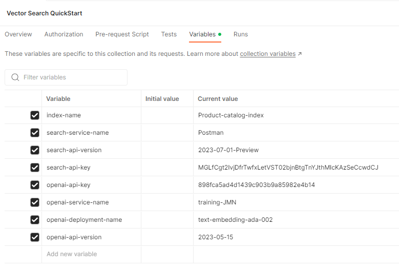

---
lab:
  title: REST API を使用してベクトル検索クエリを実行する
---

# REST API を使用してベクトル検索クエリを実行する

この演習では、プロジェクトの設定、インデックスの作成、ドキュメントのアップロード、クエリの実行を行います。

この演習を正しく行うには、次のものが必要です。

- [Postman](https://www.postman.com/downloads/) アプリ
- Azure サブスクリプション
- Azure AI Search Service
- このリポジトリ内にある Postman サンプル コレクション - *Vector-Search-Quickstart.postman_collection v1.0 json*。

> **注** Postman アプリの詳細については、必要に応じて[こちら](https://learn.microsoft.com/en-us/azure/search/search-get-started-rest)をご覧ください。

## プロジェクトの設定

まず、次の手順を行ってプロジェクトを設定します。

1. Azure AI 検索サービスの **URL** と**キー**をメモします。

    

1. [Postman サンプル コレクション](https://github.com/MicrosoftLearning/mslearn-knowledge-mining/blob/main/Labfiles/10-vector-search/Vector%20Search.postman_collection%20v1.0.json)をダウンロードします。
1. Postman を開き、**[インポート]** ボタンを選択してコレクションをインポートし、コレクション フォルダーをボックスにドラッグ アンド ドロップします。

    ![[インポート] ダイアログ ボックスの画像](../media/vector-search/import.png)

1. **[フォーク]** ボタンを選択してコレクションのフォークを作成し、一意の名前を追加します。
1. コレクション名を右クリックし、**[編集]** を選択します。
1. **[変数]** タブを選択し、Azure AI 検索サービスの検索サービス名とインデックス名を使用して、以下の値を入力します。

    

1. **[保存]** ボタンを選択して、変更を保存します。

Azure AI 検索サービスに要求を送信する準備ができました。

## インデックスを作成する

次に、Postman でインデックスを作成します。

1. サイド メニューから **[PUT Create/Update Index]** を選択します。
1. URL を、先ほどメモした **search-service-name**、**index-name** および **api-version** で更新します。
1. **[本文]** タブを選択して応答を表示します。
1. **index-name** を URL のインデックス名の値で設定し、**[送信]** を選択します。

要求が成功したことを示す **200** という種類の状態コードが表示されるはずです。

## ドキュメントのアップロード

ドキュメントのアップロード要求には 108 個のドキュメントが含まれており、それぞれに、**titleVector** および **contentVector** フィールドの埋め込みの完全なセットがあります。

1. サイド メニューから **[POST Upload Docs]** を選択します。
1. 前と同様に、URL を **search-service-name**、**index-name** および **api-version** で更新します。
1. **[本文]** タブを選択して応答を表示し、**[送信]** を選択します。

要求が成功したことを示す **200** という種類の状態コードが表示されるはずです。

## クエリの実行

1. 次に、サイド メニューで次のクエリを実行してみます。 これを行うには、必ず、前と同様に毎回 URL を更新し、**[送信]** を選択して要求を送信してください。

    - 単一ベクトル検索
    - フィルターを使用した単一ベクトル検索
    - 単純なハイブリッド検索
    - フィルターを使用した単純なハイブリッド検索
    - クロスフィールド検索
    - マルチクエリ検索

1. **[本文]** タブを選択して応答を表示し、結果を確認します。

要求が成功した場合は、**200** という種類の状態コードが表示されるはずです。
